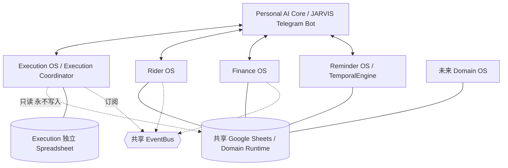
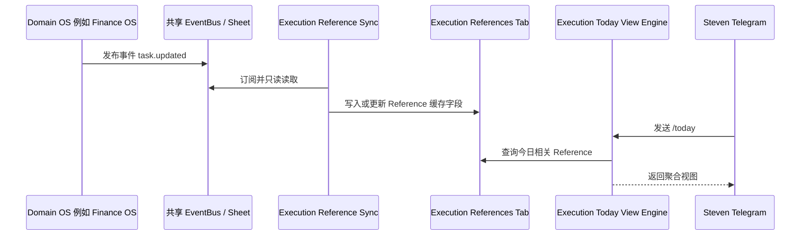

# Execution OS — Architecture Design v0.8
**状态**：多项 Accepted，整体尚未 Stable | **日期**：2026-07-25（v0.8）| **代码**：无（遵循「先设计，后代码」）
**Version Dependency**：Depends On UEF >= 1.3, Blueprint >= 1.2（见 ADR-014）

**v0.8**：补上 AI Capability 和 AI Infrastructure 之间缺的一层——AI Contract（标准化输入/输出接口，把 Domain 的业务代码和具体用哪个模型解耦）。同样不定案，等 Finance OS/News OS 真正用出证据再谈提升。这轮其余内容大部分是对已有决策的总结和确认，没有新增改动。

**v0.5 核对通过**：您上传了 UEF v1.3 与 Blueprint v1.2 的实际原文，逐条核对本文档此前基于记忆摘要写的内容（EP5：Empirical verification over inherited authority）。发现并修正：

1. **ADR 格式不对**：Status 词汇改回 UEF §0.7 定义的 Proposed / Accepted / Superseded / Rejected（之前误用"Approved"）；补上此前遗漏的 **Date** 与 **Evidence** 字段。
2. **漏了 ADR-000**：UEF §1a 要求新项目第一条 ADR 说明"为什么是独立工程"，补上。
3. **两处过度乐观的说法收回**：Planner/Projection 的晋升条件原文限定"第二个 **Domain OS** 项目"，Execution OS 不算数；Bridge 目前只有一个非正式 Tier 2 实证，Domain Adapter Registry 不是"标准用法"而是更正式的新实现。
4. **文件后缀发现真实冲突**：UEF v1.3 原文两处明确写"所有项目治理文件用 `.txt`，绝不用 `.gs`"；但另有记录显示您在 2026-07-20 把惯例改成了 `.js`。v0.5 当时先按 UEF 原文（更晚的落款日期）用 `.txt`，标注待确认——见下方 v0.6 的解决。
5. Blueprint 自己的 Governance 节点引用写着"UEF v1.1"，实际 UEF 已到 v1.3（章节号本身没变，只是版本标签没跟上）——如实指出，非本文档能编辑的地方。

**v0.6 新增（Steven 确认后落地）**：

1. **文件后缀：确认用 `.js`**——已改回。但这不代表冲突已解决：UEF v1.3 原文本身仍然写 `.txt`，这是 UEF 源文件自己的 Documentation Drift（EP2），需要在 UEF 那边修一次，本文档只能在自己范围内跟随您的确认。
2. **Execution OS 使用独立 Spreadsheet，不与 Domain 共享**（ADR-012）——理由是所有权边界，不是性能；见 §1.1 更新后的图、§6.3。
3. **AI 调用统一走 Personal AI Core**（ADR-013）——但发现一个尚未解决的矛盾：Finance OS 自己的提案里有独立的 `906_AI_Integration` 模块，如果"统一集中"成为通用原则，那部分提案需要重新评估，本文档不能替 Finance OS 决定。
4. **Blueprint 的 v1.1 引用怎么修**：确认这是纯 PATCH 级修正（UEF §0.8："wording/clarity fixes, no semantic change"），不需要 ADR——这个判断本轮已对照 §0.8 原文核实，不是单纯采信建议。
5. **新增 Version Dependency 治理惯例**（ADR-014）——本文档现在显式声明依赖的 UEF/Blueprint 最低版本（见上方）。
6. **§0 补一句 Constitution 级边界声明**（见下方）。

**已 Accepted 决策**（Steven 确认，2026-07-25）：

| 决策 | 对应 ADR | 内容 |
|---|---|---|
| UEF/Blueprint 采用方式 | ADR-001 | 方案 C：UEF 全采用，Blueprint 选择性采用 |
| 为什么是独立工程 | ADR-000 | 核对 UEF §1a 后补上的必需项 |
| Execution Reference Contract | ADR-008 | §3.2 字段表定稿（Accepted，非 Stable）|
| 更名为 "Execution OS" | ADR-009 | 已执行 |
| Producer/Consumer 候选原则的处理方式 | §9 候选架构原则 | 留在本文档，暂不提交 Blueprint，等有代码证据再说 |
| Reference 同步完整性 | ADR-010 | snapshot_hash + 时间戳排序 |
| Waiting Item 分类模型 | ADR-011 | Reason × Party 两层模型 |
| 独立 Spreadsheet | ADR-012 | Execution 只读访问 Domain Spreadsheet，永不写入 |
| AI 调用集中化 | ADR-013 | 统一走 Personal AI Core（细节待核实，见 §10.3）|
| Version Dependency 惯例 | ADR-014 | 本文档显式声明版本依赖 |
| Stable 判断 | — | 维持"尚未 Stable"，不提前宣称 |

**状态词汇约定**：ADR 的 Status 用 UEF §0.7 定义的 Proposed / Accepted / Superseded / Rejected；文档整体成熟度用 UEF/Blueprint 自己的惯例描述——"Stable" 只在有真实代码、经过生产验证后才使用，目前零代码，无论哪个章节都还到不了 Stable。

**使用说明**：本文档按您要求的 10 个章节组织，每节尽量给出明确决策 + 简要理由；无法在现有信息基础上确定的地方，标注为「待核实 / 待决」而不是假设一个答案。所有待决项汇总在文末《待决问题清单》。凡本文档中出现的规则/字段，在正式落地前状态一律为 **Planned**（未实现），符合既有治理惯例——不把提案写成既成事实。

---

## 目录
0. System Identity
1. Architecture
2. Boundary
3. Data Ownership
4. Execution Flow
5. Cross-Domain Integration
6. Google Sheets
7. File Map
8. Business Rules
9. ADR
10. 与 Personal AI Core 的接口
附录 A：Metadata 新增字段（AI Confidence / Reason）
待决问题清单

---

## 0. System Identity

**Execution OS 不是 Domain OS。**

它是 **Execution Coordinator（执行协调器）**：运行在所有 Domain OS 之上的协调层，负责"人生执行"本身（Vision → Goal → 落地 → 复盘），而不承载任何单一领域的业务数据。

**一句话定位**：Execution OS 是整个 Personal AI Ecosystem 的执行协调层（Execution Coordination Layer），负责聚合、规划、排序、回顾与跨 Domain 协调，但永远不是任何 Business State 的拥有者。

**Constitution 边界声明**（v0.6 新增，建议直接写进未来的 00_Project_Constitution.js）：

> Execution OS 不拥有任何 Business Data；它只拥有 Execution Data，并通过 Reference 与各 Domain 建立关联。

只要这条不被打破，未来无论增加 Health OS、Content OS 还是其他任何 Domain，整体架构都不需要重构。

### 拥有（Owns）
| 层 | 实体 |
|---|---|
| 意图层 | Vision, Goal |
| 执行层 | Execution Project, Planning |
| 视图层 | Today View, Week View, Dashboard |
| 治理层 | Review, Waiting, Execution Event |
| 连接层 | Execution Reference（指针，不是数据本身）|

### 永不拥有（Never Owns）
Business Task / Business Project / Business Timeline / Business Event —— 这些永远属于产生它们的 Domain（如 [[rider-os]] 的 Booking、Finance OS 的 Net Worth 与 Financial Timeline、未来 Property OS 的 Timeline……）。

### 关系声明
- **与 UEF**：完整采用（见 §1.2、ADR-001）
- **与 Blueprint**：选择性采用能力节点，不采用其"Domain 拥有业务 Schema"的隐含前提（见 §1.2、ADR-001）
- **与 Personal AI Core**：兄弟工程（sibling project），共享 Google Sheets 后端与 EventBus 基础设施（见 §10）
- **与所有 Domain OS**：只读单向观察，通过 Reference 引用，从不写入、从不复制、从不拥有

---

## 1. Architecture

### 1.1 生态定位



Execution OS 与 Rider OS / Finance OS / Reminder OS 是平级的独立 GAS 工程，唯一的特殊之处是：它不产生业务数据，只协调/聚合其他工程已产生的数据。

### 1.2 UEF / Blueprint 采用决策（结论）

**决策**：UEF 完整采用；Blueprint 选择性采用（只复用能力节点概念，不套用 Domain Data Ownership 假设）。完整的 Question → Options → Decision 记录见 **ADR-001**。

简要理由：UEF 定义的是"如何做工程"（治理文档、ADR、Risk Matrix、Review Workflow），这与项目是不是 Domain 无关，没有理由不用。Blueprint 定义的是"Domain OS 可以包含什么"（[[universal-domain-os-blueprint]] 的 BP-6：能力/构建块，从不定义实现细节）——Execution OS 复用其中真正通用的能力节点，跳过不适用于自己的所有权假设，并不违反 Blueprint 自身的设计哲学。

### 1.3 Execution OS 的分层架构（对照 Blueprint v1.2 原文的节点级 Tier）

| Blueprint 层 | 相关节点 Tier（Blueprint v1.2 原文核实） | Execution OS 版本内容 |
|---|---|---|
| 0. Governance | — | 指向 UEF，拥有自己的 00_Project_Constitution 等（同 BP-1）|
| 1. Foundation | Schema=T1, Event Definitions=T1, Configuration=T1, Versioning=T1；Identity=T2（仅 Rider OS 实证）；Permissions=T3（零证据）| Schema 只定义 Execution 原生实体，不含任何 Business Schema；Permissions 暂不设计（单用户系统，符合 EP3 反过早工程）|
| 2. Runtime | Request=T1, Event=T1, Query=T1, "Execution"节点=T1（服务层，与本项目名"Execution OS"是两回事，见 §1.4 注）；**Planner=T2（仅 Rider OS RewardService 一例）**；**Projection=T2（仅一例）**；Decision=T2；User Confirmation=T3 | Planning Engine 对应 Planner 节点，Today/Week View 对应 Projection 节点——两者目前都只有单一实证，见下方修正说明；Decision/User Confirmation 暂不设计 |
| 3. Intelligence | 全部 T2 或 T3（Analytics=T2, Prediction=T2, 其余 T3，零 ML/自适应学习证据）| AI Planning Connector 建立在低证据基础上，不代表已是跨项目稳定模式 |
| 4. Integration | Connectors=T1（Telegram Bot API）；**Bridge=T2（仅"共享 Sheet 作为非正式 bridge"一例）**；APIs/Import-Export=T3；External Systems=T2 | Domain Adapter Registry 是对 Bridge 节点的正式化实现，不是复用已成熟模式——见 §5.1 的修正说明 |
| 5. Testing | Unit Tests=T1；Migration Tests=T2；Validation=T2（仅 Rider OS 确认包含人工 checklist 半）| 与其他工程相同的自动化 + 人工 checklist 惯例 |
| Cross-Cutting | Observability=T2, Diagnostics=T2；Security=T3, Telemetry=T3 | 复用 Observability/Diagnostics，其余不设计 |

> **修正（核对 Blueprint v1.2 原文后）**：上一版这里写"若 Execution OS 的 Planning Engine 与 Today/Week View Projection 独立成型，会恰好满足晋升 Tier 1 的触发条件"——核对原文后这个说法过于乐观，需要收回。Blueprint 原文对晋升触发条件的措辞是"a second **Domain OS** project"（Projection）和"a second independent **domain**"（Planner）——两处都明确用的是 Domain 语言，而 Execution OS 按 ADR-001 明确不是 Domain OS。Execution OS 的实现算不算数，原文没有回答，不该由本文档替 Blueprint 做扩大解释；如果未来希望它算数，这本身可能需要先提交给 Blueprint 讨论（也受 UEF §0.9 的两项目证据门槛约束），而不是这里单方面假设。

### 1.4 模块 → 分层归属

> 注：下表"Runtime（Execution）"里的"Execution"，指的是 Blueprint Runtime 层里一个叫 "Execution" 的节点（服务层，Tier 1），跟本项目名称 "Execution OS" 是两个不同的东西——名字撞在一起纯属巧合，容易看混，这里说明一下。

| 模块 | Blueprint 层 |
|---|---|
| Vision Engine | Foundation（Schema）+ Runtime（Execution 节点） |
| Goal Engine | Runtime（Execution 节点）|
| Execution Project Engine | Runtime（Execution 节点）|
| Today View Engine | Runtime（Projection/Query）|
| Week View Engine | Runtime（Projection/Query）|
| Planning Engine | Runtime（Planner）|
| Dashboard Engine | Runtime（Projection）|
| Review Engine | Runtime（Execution 节点）+ Intelligence（AI 摘要辅助）|
| Waiting Engine | Runtime（Execution 节点）|
| Execution Event Engine | Runtime（Event）|
| AI Planning Connector | Intelligence |

---

## 2. Boundary

### 2.1 硬边界

| 实体 | 归属 | 说明 |
|---|---|---|
| Vision / Goal / Execution Project / Planning / Today View / Week View / Dashboard / Review / Execution Event | **Execution OS** | 原生实体，本项目是 Single Source of Truth |
| Business Task | **Domain**（每个 Domain 自己）| 如 Rider OS 的 Booking |
| Business Project | **Domain** | 如未来 Property OS 的装修项目 |
| Business Timeline | **Domain** | 如 Finance OS 的 180_FinancialTimeline |
| Business Event | **Domain** | 各 Domain 自己的事件流，Execution 只订阅不占有 |

Execution 触碰 Domain 数据的唯一合法方式：**Execution Reference**（见 §2.5、§3.2）。

### 2.2 "Goal" 消歧：Execution Goal vs Domain Goal

Finance OS 的提案结构中已经有 `160_Goals`（财务目标，如"存够一笔钱"）。这与 Execution OS 的 Goal Engine 是两个不同层次的概念，容易混淆，需要明确区分：

- **Execution Goal**（Execution OS 拥有）：跨领域、人生层面的目标，可以由多个 Domain 的数据共同支撑（例：「38 岁财务自由」可能同时关联 Finance OS 的净值曲线 + Investment 的组合表现 + Rider OS 的兼职收入）。
- **Domain Goal**（如 Finance OS 的 160_Goals）：单一领域内部的具体指标目标，完全由该 Domain 拥有、计算、维护。

规则：Domain Goal **可以**被一个 Execution Goal 引用（作为支撑证据/子目标），但 Execution 永远不复制 Domain Goal 的进度、算法或数据——只保留一个指向它的 Reference。

### 2.3 "Project" 消歧：Execution Project vs Business Project

Execution Project 的核心价值恰恰是**跨领域协调**——例如"买房"这个 Execution Project，可能同时引用 Property OS 的看房记录、Finance OS 的首付进度、Procurement OS 的装修采购——它不是任何单一 Domain 的 Project 的复制品，而是这些 Reference 的集合容器。单一 Domain 内部的 Project（如未来某 Domain 自己的项目管理）保持 Business Project，永远只被引用。

### 2.4 "Event" 消歧：Execution Event vs Business Event

Execution Event 是 Execution **自己**的事件溯源日志（goal.created、execution_project.status_changed、review.completed……），记录的是 Execution 原生实体的变化，与 Domain 自己的 Business Event（如 Rider OS 的 booking 事件）是两条独立的事件流。Execution 可以**订阅** Domain 的 Business Event（用于同步 Reference，见 §5），但不会把 Domain 事件写进自己的 Execution Event 日志里、也不会反向让 Domain 订阅自己。

### 2.5 Reference：唯一合法的边界穿越对象

所有指向 Domain 数据的指针，无论来自 Vision、Goal、Execution Project、Today View 还是 Waiting Engine，最终都落在**同一个** Reference 结构上（见 §3.2）。这是整个边界设计里唯一被允许"看到"Domain 数据的地方，其余所有模块只能持有 Reference 的 ID，不能持有 Reference 之外的任何 Domain 字段。

---

## 3. Data Ownership

### 3.1 所有权总表

| 实体 | Owner | Execution 能否持有 | 备注 |
|---|---|---|---|
| Vision | Execution OS | 原生 | 层级最高，通常无 Domain 对应物 |
| Goal（人生层） | Execution OS | 原生 | 10Y→Today 各 Horizon |
| Execution Project | Execution OS | 原生 | 跨 Domain 协调容器 |
| Reference | Execution OS | 原生（指针） | 唯一穿越边界的对象 |
| Today View / Week View | Execution OS | 计算视图，非存储业务数据 | 见 ADR-004 |
| Dashboard | Execution OS | 计算视图 + 少量原生 Config | 同上 |
| Review | Execution OS | 原生 | Daily/Weekly/Monthly/Quarterly/Yearly |
| Waiting Item | Execution OS | 原生，链接 Reference | |
| Execution Event | Execution OS | 原生事件日志 | |
| AI_Suggestions_Log | Execution OS | 原生（新增，见 ADR-005） | |
| Business Task/Project/Timeline/Event | 各 Domain | 仅 Reference | Single Source of Truth 永远在 Domain |
| Domain Goal（如 Finance OS 160_Goals） | 各 Domain | 仅 Reference | 见 §2.2 |
| Reminder Rule | 各 Domain | 仅 Reference（可选） | 各 Domain 定义"何时提醒"；实际排程/发送仍由 Reminder OS/TemporalEngine 统一执行（见 §10.5）——这与 Reminder OS 自己尚未回答的 "Reminder Rules storage" 开放问题直接相关，不建议在这里单方面定案 |

### 3.2 Execution Reference 结构（已按 ADR-008 / ADR-010 定稿）

| 字段 | 说明 |
|---|---|
| `reference_id` | Execution 生成的稳定 ID |
| `source_domain` | 来源 Domain（如 "Finance OS"）|
| `source_entity_type` | 来源类型（Task / Project / Timeline / Domain Goal / ...，开放枚举）|
| `source_entity_id` | 该 Domain 内部的原生 ID（回链 Single Source of Truth 的 key）|
| `snapshot_title` | 缓存展示字段，仅用于呈现，**非权威数据**——命名强调这是"某次同步时刻的快照" |
| `snapshot_status` | 缓存展示字段（同上性质）|
| `snapshot_due` | 缓存展示字段（如有）|
| `snapshot_hash`（v0.4 新增） | Execution 本地计算的内容指纹（对 snapshot_* 字段取 hash），用于低成本判断"这次同步内容是否真的变了"，见 ADR-010 |
| `execution_priority`（新增） | Execution 自己对这条 Reference 的优先级判断，与 Domain 无关 |
| `ai_recommended_priority`（新增） | AI 建议的优先级；与 `execution_priority` 对比即可看出是否被采纳 |
| `execution_state`（新增） | Execution 自己的工作流位置：Inbox / Today / This_Week / Waiting / Done 等——这是 Execution **原生**状态，不是 Domain 数据副本；Today View/Week View 靠过滤这个字段生成，不违反 ADR-004"View 不持久化" |
| `attached_to` | 结构性挂载：Goal / Execution Project / Waiting Item |
| `deep_link` | 跳回 Domain 的指令/链接（如 Telegram 指令）|
| `created_at`（新增） | 该 Reference 首次建立的时间 |
| `last_synced_at` | 最近一次同步时间 |
| `sync_mode` | Rich Event / Trigger-Only（见 §5.2）|
| `status` | Active / Stale / Orphaned（见 §3.4）|

### 3.3 Metadata Block（Goal / Vision / Execution Project / Review 共用）

| 字段 | 说明 |
|---|---|
| `Creator` | Steven 或 AI Planning Connector |
| `Suggested_By` | 建议来源：人，或具体 AI（如 "Investment AI"、"Claude"、"AI Planning Connector"）——与 Source_Domain 是两个独立维度 |
| `Source_Domain` | 触发/数据来源的 Domain；原生创建则为 "Execution OS" 或 null |
| `Source_Reference` | 若来自某 Domain 数据点，指向具体 Reference |
| `Created_Method` | `Manual` / `AI_Suggested` / `Imported` / `Recurring_Generated` / `Review_Generated` |
| `Priority` | 人最终采纳/设定的优先级 |
| `AI_Recommended_Priority` | AI 建议的优先级——与 `Priority` 对比，天然记录了"人是否采纳 AI 建议"，不需要额外字段 |
| `AI_Confidence`（新增，见附录 A） | 0–100，`Created_Method = AI_Suggested` 时必填 |
| `AI_Reason`（新增，见附录 A） | AI 建议理由，同上必填 |

**示例**（沿用您给的例子，展示落到 AI_Suggestions_Log 后的样子）：

```
Suggestion_ID:        SUG-2026-000123
Proposed_Title:       研究 CIMB
Suggested_By:         Investment AI
Source_Domain:        News OS
Source_Reference:     REF-NEWSOS-000456
AI_Confidence:        92
AI_Reason:            Q2 财报将在三天后公布，与投资策略高度相关
Outcome:               Adopted / Rejected / Modified / Pending
Resulting_Entity_ID:  （若 Adopted，指向实际创建的 Goal 或 Execution Project）
```

### 3.4 Single Source of Truth + 过期 Reference 处理

- 权威数据永远在 Domain；Reference 的缓存字段（`snapshot_*`）可以过期，但**绝不能被当作权威数据使用**。
- 若同步时发现 `source_entity_id` 在 Domain 已找不到（被删除/归档）：Reference 标记为 `Stale`，不静默消失，在 Dashboard 中显式提示需要人工处理（见 BR-2）。
- N 天（默认建议 30，待您确认）未能重新解析的 `Stale` Reference 转为 `Orphaned`，从常规视图中隐藏但保留历史记录，不物理删除（保持审计完整性，符合既有的"不做回溯性重建、只向前记录"的惯例）。

### 3.5 Waiting Item 结构（按 ADR-011 采用 Reason × Party 两层模型）

不按"等待对象"分类（Waiting_Bank/Waiting_Developer/...），因为这个列表会随着新的等待对象出现（配偶、政府、某个 AI……）无限增长。改用两个独立维度：

| 字段 | 说明 |
|---|---|
| `waiting_id` | |
| `reason` | 封闭枚举：`External_Response`（等对方回应/处理，无固定日期）/ `Approval`（等正式批准或决定）/ `Time`（等一个已知的时间点，如财报发布日）/ `Dependency`（等 Execution 内部另一个 Goal/Execution Project 先完成——`party` 此时指向该 Execution 实体的 ID，不是外部方）/ `Manual_Hold`（自己主动搁置，通常没有 `party`）|
| `party` | 开放文本：等的是谁/什么（如 "Maybank"、"Developer"、"Bursa Malaysia"、某个 Execution 实体 ID）；`reason=Manual_Hold` 时可为空 |
| `linked_reference` | 关联的 Reference（如有，见 BR-6）|
| `expected_at` | 预期解决的时间点（`reason=Time` 时建议必填）|
| `follow_up_at` | 下次该提醒跟进的时间（交由 Reminder OS 排程，见 §10.5）|
| `status` | Waiting / Resolved |

例：等 Developer 修 Defect → `reason=External_Response, party=Developer`；等财报 → `reason=Time, party=Bursa Malaysia, expected_at=Q2 Release`；等银行贷款批准 → `reason=Approval, party=Maybank`。

---

## 4. Execution Flow



**Flow A｜Domain 数据变化 → Reference 同步**：Domain 发布事件（或被定期扫描）→ Execution Integration 层按已注册的 Adapter 规则解析 → 写入/更新对应 Reference 的缓存字段 → 不触碰 Domain 的任何数据。

**Flow B｜Goal 创建（人工）**：Steven 创建 Goal → Goal Engine 写入 Goals Tab（含 Metadata Block，`Created_Method=Manual`）→ 发布 Execution Event `goal.created`。

**Flow C｜Goal 创建（AI 建议）**：AI Planning Connector 提出建议 → 先写入 AI_Suggestions_Log（含 Confidence/Reason）→ Steven 通过 Telegram/Dashboard 审核 → 采纳后才生成正式 Goal 记录（`Created_Method=AI_Suggested`，`Source_Reference` 指向该条 Suggestion）→ 未采纳的建议保留在 Log 中，`Outcome=Rejected`，永不删除。

**Flow D｜Today View 查询**：`/today` → 聚合当日相关 Reference（跨 Property/Life/Investment/Rider/Health/Procurement/Inventory 等）+ 今日 Horizon 的 Goal/Execution Project + 需跟进的 Waiting Item + 手动 Pin/Snooze → 实时/按缓存 TTL 拼装返回，**过程中不产生任何 Domain 数据副本**。

**Flow E｜Review 触发**：由 Reminder OS/TemporalEngine 按 Daily/Weekly/Monthly/Quarterly/Yearly 排程触发（见 §10.5）→ Review Engine 汇总 Goal 进度（含关联 Reference 的缓存状态）、Execution Project 状态、Waiting 老化情况、期间 Execution Event → 可选调用 AI Planning Connector 生成初稿摘要 → Steven 确认/编辑后落定为正式 Review 记录 + 发布 `review.completed` 事件。

**Flow F｜Reference 失效处理**：见 §3.4。

**Flow G｜Today View 完成动作回写 Domain**（v0.2 新增）：Steven 在 Today View 里把某个 Reference 标记完成 → Execution **不直接写入**该 Reference 指向的 Domain Sheet → Execution 发布自己的 Execution Event（如 `execution.reference_completed`，Execution 本来就拥有 Execution Event，见 §0）→ 该 Reference 所属的 Domain（如果选择订阅）在自己的 EventBus 消费该事件 → 由 Domain **自己的代码**写入自己的状态（如 Property OS 把 Task 标记 Paid）→ Business Timeline 与 Execution Event 各自完整，互不污染，也不违反 BR-10/BR-11（Execution 从未直接写过 Domain 的 Sheet）。是否订阅、如何处理，完全由 Domain 自己决定——不属于 Execution 零修改承诺范围内的强制项。

---

## 5. Cross-Domain Integration

**设计目标**（直接对应您的要求）：任何 Domain OS，无论现在存在还是未来新建，都不需要修改自己的架构就能被 Execution OS 接入。

### 5.1 核心机制：适配全部在 Execution 一侧

所有"某个 Domain 的哪个 Tab、哪个字段对应什么"的映射逻辑，**只存在于 Execution 自己的 Integration 层（Domain Adapter Registry）**，不要求 Domain 侧新增一行代码。这是 Blueprint Integration 层 Bridge 节点的一个实例——但需要说明清楚：核对 Blueprint v1.2 原文，Bridge 目前只有 Tier 2 证据，且唯一的实证是"共享 Sheet 被非正式地当作 bridge 使用"。Domain Adapter Registry 比这更正式、更结构化，不是在套用一个已经成熟的标准模式，而是这个概念目前唯一的、更进一步的实现——上一版说这是"标准用法"不准确，已更正。

### 5.2 双模式：Rich Event Mode / Trigger-Only Mode

每个 Domain 自动获得 **Trigger-Only Mode**（零前提条件）：Execution 按排程（依赖 Reminder OS，见 §10.5）直接只读扫描该 Domain 已注册的 Tab，按 Adapter 配置的字段映射生成/更新 Reference。

若该 Domain 现有的 Event Definitions（Blueprint Runtime > Event 层，Rider OS 已验证为 Tier 1）恰好已经携带足够字段（entity_id / type / title / status），Execution 可以额外订阅其事件，升级为 **Rich Event Mode**，做到近实时同步——这只取决于 Domain 现有事件是否已经够用，**不要求 Domain 为了配合 Execution 而修改事件结构**。若某天 Domain 主动想丰富自己的事件（纯增量字段，不破坏兼容性），可以自愿升级，但这从来不是接入 Execution 的前提。

### 5.3 与 Domain Ownership（P7）原则的一致性

Personal AI Core 已确立 Domain Ownership 为 Constitution 原则（P7）。Reference Sync 严格只读，从不写入任何 Domain 自己的 Tab，与 P7 完全一致，不需要为此新开一条例外规则。

### 5.4 新 Domain 接入 Checklist（全部发生在 Execution 一侧）

1. 决定要接入哪个 Domain OS
2. 在 Domain Adapter Registry 新增一条配置：Domain 名称、目标 Tab、字段映射（id/title/status/updated_at/priority/due）、（可选）订阅的 Event Type
3. 以只读方式首次全量 Reconciliation，生成初始 Reference
4. 若字段足够，升级为 Rich Event Mode；否则保持 Trigger-Only（定期由 Reminder OS 触发）
5. 全程 **Domain OS 自身代码零修改**

### 5.5 示例配置（说明性，非最终 Schema）

| Domain | 目标 Tab | 关键字段映射 | 模式 |
|---|---|---|---|
| Rider OS | Bookings / Maintenance | id→source_id, status→display_status | Trigger-Only（起步）|
| Finance OS | 160_Goals / 180_FinancialTimeline | id→source_id, progress→display_status | Trigger-Only（起步）|
| Personal Life OS（提案中，v0.2）| LIFE_PROJECTS / LIFE_TASKS | id→source_id, status→display_status | Trigger-Only（起步）|

（是否已有可用事件足以升级 Rich Event Mode，需要对照现有项目实际事件字段核实，本提案不假设。Personal Life OS 是否真的适合直接由 Productivity OS 演进而来，同样需要先核实 Productivity OS 现有 Schema，见待决问题清单第 11 项。）

---

## 6. Google Sheets

### 6.1 Tab 清单

| Tab | 对应模块 | 性质 |
|---|---|---|
| Visions | Vision Engine | 原生存储 |
| Goals | Goal Engine | 原生存储（含 Metadata Block）|
| Execution_Projects | Execution Project Engine | 原生存储（含 Metadata Block）|
| References | 跨模块共用 | 原生存储（§3.2 结构）|
| Waiting_Items | Waiting Engine | 原生存储 |
| Reviews | Review Engine | 原生存储（含 Metadata Block）|
| Execution_Events | Execution Event Engine | 原生事件日志（append-only）|
| AI_Suggestions_Log | AI Planning Connector | 原生事件日志（append-only）|
| Today_View_Overrides | Today View Engine | 原生存储，仅 Pin/Snooze 等人工覆盖，**不存视图内容本身** |
| Dashboard_Config | Dashboard Engine | 原生存储，纯布局/展示配置 |

### 6.2 关键字段
见 §3.2（References）、§3.3（Metadata Block）；其余 Tab 的完整字段清单建议在本提案签核后、写代码前单独产出（对应 §7 的 Schema 文件），避免本文档过度膨胀。

### 6.3 物理拓扑（已按 ADR-012 定案）
Execution OS 使用**独立的 Spreadsheet**，不把自己的 Tab 放进现有 Domain 共享的 Google Sheets 后端。Execution 对 Domain 的共享后端只有只读访问，永不写入——物理隔离让这条规则从"约定"变成"结构上很难违反"。现有 Domain 共享后端具体是几个物理文件，仍然不影响这个决策（Execution 不需要知道细节，只需要只读权限），但对 Domain 侧的实现仍然有意义，保留在待决问题清单。

---

## 7. File Map

### 7.1 治理文件（沿用 [[rider-os]] 已验证的 00_ 惯例，理由见 §7.3）
- `00_Project_Constitution.js`
- `00_Business_Rules.js`
- `00_Project_State.js`
- `00_File_Map.js`
- `00_ADR_Log.js`

### 7.2 分层文件（提案编号，供签核）

| 编号段 | 层 | 文件（示例）|
|---|---|---|
| 10–19 | Foundation | 10_Schema.js / 11_EventDefinitions.js / 12_Identity.js / 13_Permissions.js / 14_Versioning.js |
| 20–29 | Runtime（Engine 核心） | 20_Router.js / 21_Parser.js / 22_VisionEngine.js / 23_GoalEngine.js / 24_ExecutionProjectEngine.js / 25_TodayViewEngine.js / 26_WeekViewEngine.js / 27_PlanningEngine.js / 28_DashboardEngine.js / 29_ReviewEngine.js |
| 30–34 | Runtime（续） | 30_WaitingEngine.js / 31_ExecutionEventEngine.js |
| 40–49 | Intelligence | 40_AIPlanningConnector.js / 41_GoalDecompositionAssist.js / 42_PrioritySuggestion.js |
| 50–59 | Integration | 50_DomainAdapterRegistry.js / 51_ReferenceSync.js / 52_ReminderOSAdapter.js / 53_PersonalAICoreAdapter.js |
| 60–69 | Cross-Cutting | 60_Observability.js / 61_Diagnostics.js |
| 90–99 | Testing | 90_UnitTests.js / 91_ManualChecklists.js |

**后缀：`.js`（本轮 Steven 确认）**。上一版这里标了一个待确认的冲突：UEF v1.3 原文两处明确写"All project-level governance files use `.txt`... never `.gs`"（Format Note 里给的原因是 `.txt` 文件要包在 `/* */` 注释块里塞进 GAS Script Editor，跟真代码放一起但不被当成可执行代码），而我手上另有记录说您在 2026-07-20 把这个惯例从 `.txt` 改成了 `.js`。这版按您的确认统一用 `.js`。**这不代表冲突已经解决**——UEF v1.3 这份原文本身仍然写着 `.txt`，日期比那条 2026-07-20 的记录还晚，却完全没吸收这个变化，这是 UEF 源文件自己真实存在的 Documentation Drift（EP2），需要在 UEF 本身那边修一次，不是靠本文档单方面改用词就能解决的（见待决问题清单）。

### 7.3 编号规则选择理由
两种现存惯例：Rider OS 的 `00_` 两位数前缀（**Tier 1，已在生产验证**）与 Finance OS 提案的 900/100 三位数分段（**Tier 3，概念阶段，尚未建成**）。按 Blueprint 自身的证据分级逻辑（BP-2），本提案选择前者作为默认，并标注：若未来"Jarvis AI Ecosystem"共享目录方案落地、需要跨项目编号不冲突，届时再与 Finance OS 一起重新协调（见 ADR-006）。

---

## 8. Business Rules

全部标注为 **Planned**（尚未实现），符合治理惯例。

| ID | 规则 | 状态 | 相关 ADR |
|---|---|---|---|
| BR-1 | Execution 不得创建任何 Domain 业务实体的完整副本；只允许持有带缓存展示字段的 Reference | Planned | ADR-002 |
| BR-2 | 每条 Reference 必须可回链 `source_domain`+`source_id`；无法解析的 Reference 标记 Stale，绝不静默消失 | Planned | ADR-002 |
| BR-3 | Goal 的 Horizon 层级必须自洽：子 Goal 的 Horizon 不得长于父 Goal（如 Quarter 目标的父目标不能是 Week 目标）| Planned | — |
| BR-4 | `Created_Method=AI_Suggested` 的记录必须同时填写 `AI_Confidence` 与 `AI_Reason` | Planned | ADR-005 |
| BR-5 | AI 建议的每次生成都写入 AI_Suggestions_Log，不覆盖历史记录；被拒绝的建议同样永久保留 | Planned | ADR-005 |
| BR-6 | Waiting Item 必须关联至少一条 Reference，或显式标注"无 Domain 关联"（如纯等人）| Planned | — |
| BR-7 | Today View / Week View 不得持久化聚合后的业务数据；只能保留 Pin/Snooze 等人工覆盖 | Planned | ADR-004 |
| BR-8 | Domain 接入 Execution 不得要求该 Domain 修改自身代码；所有适配逻辑必须落在 Execution 的 Integration 层 | Planned | ADR-003 |
| BR-9 | Execution 自己的治理文件（Constitution/Business Rules/Project State/File Map/ADR Log）与每次代码变更同步，遵循既有标准工作流 | Planned | — |
| BR-10 | Reference 同步严格只读，永不写入任何 Domain 自己的 Tab（Domain Ownership P7）| Planned | ADR-003 |
| BR-11（新增）| Execution 的"完成/更新"动作不得直接写入任何 Domain 的 Sheet；只能发布 Execution Event，由 Domain 自行决定是否订阅并写自己的状态 | Planned | ADR-007 |
| BR-12（新增）| Waiting Item 必须同时填写 `reason` 与（除 `Manual_Hold` 外）`party`；不得只用自由文本描述等待状态而不分类 | Planned | ADR-011 |

---

## 9. ADR

> 格式对齐 UEF §0.7 的 ADR 结构（本轮已核对 v1.3 原文；该条款的章节号自 v1.1 起未变）。Status 用 UEF 定义的四个值：**Proposed / Accepted / Superseded / Rejected**——上一版这里错用了"Approved"，不是 UEF 的实际词汇，这版已全部改回 **Accepted**。每条新增了 **Date** 与 **Evidence** 字段（此前遗漏）；Evidence 按 EP5 如实区分"本轮核实"与"沿用先前记录、未重新验证"，不假装比实际掌握的更确定。

### ADR-000：为什么 Execution OS 是独立 GAS 工程
- **Status**：Accepted
- **Date**：2026-07-25
- **Context**：UEF §1a 要求新项目的第一条 ADR 说明"为什么是独立工程而不是塞进现有项目的模块"（Domain Ownership，P7 风格）——这是本轮核对 UEF 原文后发现前几版遗漏的一项，这里补上。
- **Question**：Execution OS 应该是独立 GAS 工程，还是 Personal AI Core／Productivity OS 的一个模块？
- **Options Considered**：A. 作为 Personal AI Core 的模块；B. 作为 Productivity OS（未来可能的 Personal Life OS）的模块；C. 独立 GAS 工程
- **Decision**：C
- **Evidence**：本轮核实范围是 UEF v1.3／Blueprint v1.2 文档原文本身，不含 Personal AI Core／Productivity OS 的现场代码核实——这条决策目前只基于既有设计事实推理（Execution OS 要跨越所有 Domain 协调，职责性质与任何单一 Domain 不同，符合 Personal AI Core 已确立的 Domain Ownership 分离逻辑），按 EP5 如实标注为"未直接验证"。
- **Impact**：Execution OS 拥有独立的五件套治理文件（同 Rider OS 惯例，见 §7.1）。
- **Next Steps**：无。
- **Related ADRs**：ADR-001
- **Review Trigger**：不适用（初始化决定）。

### ADR-001：Execution OS 的 UEF / Blueprint 采用方式
- **Status**：Accepted（Steven 确认，2026-07-25）
- **Date**：2026-07-25
- **Context**：Execution OS 不是 Domain OS，需要先确定它与 UEF/Blueprint 的关系，否则后续所有章节没有地基。
- **Question**：Execution OS 不是 Domain OS，是否仍采用 UEF 与 Blueprint？
- **Options Considered**：A. 完全采用 UEF + 完全采用 Blueprint（当普通 Domain OS 对待）；B. 完全采用 UEF + 完全不采用 Blueprint（自建结构）；C. 完全采用 UEF（工程纪律与是否 Domain 无关）+ 选择性采用 Blueprint（只复用能力节点，跳过 Domain Data Ownership 假设）
- **Decision**：C
- **Evidence**：本轮已直接核对 UEF v1.3 与 Blueprint v1.2 原文（不再只凭记忆摘要）：UEF §0.1 的 EP1-6 是工程纪律条款，条文本身与项目是否 Domain 无关；Blueprint BP-6 原文"defines capabilities and architectural building blocks, never implementation details"，支持选择性复用而非全盘照搬或全部弃用。
- **Impact**：Execution OS 拥有标准五件套治理文件（§7.1），但 Foundation 层 Schema 只定义 Execution 原生实体，不定义任何 Business Schema。
- **Next Steps**：无。
- **Related ADRs**：ADR-000；UEF-ADR-002（Cross-Cutting Capabilities，同属"生态级结构决策"先例）
- **Review Trigger**：出现第二个"非 Domain"的协调层项目时，重新评估 C 方案是否该沉淀为 Blueprint 的新分支。

### ADR-002：Reference-Only 数据所有权模型
- **Status**：Accepted
- **Date**：2026-07-25
- **Context**：需要决定 Execution 面对高频访问的 Domain 数据时，是否允许保留完整本地副本以换取速度。
- **Question**：Execution 是否应该为常用 Domain 数据保留完整本地副本，还是严格只保留 Reference？
- **Options Considered**：A. 完整副本缓存（读取快，但产生双重数据源）；B. 严格 Reference-Only，仅缓存少量展示字段
- **Decision**：B
- **Evidence**："双重数据源导致一致性问题"（如 Rider OS 曾出现的重复计算逻辑）是沿用先前记录，本轮未重新核实源代码，按 EP5 标注为未验证。本轮新验证的是 UEF EP4（单一计算来源）原文，与这个决策方向一致。
- **Impact**：所有跨 Domain 展示都依赖 Reference 的缓存字段，可能有轻微过期窗口，但不会出现"Execution 里的数字和 Domain 里的数字对不上"的问题。
- **Next Steps**：无。
- **Related ADRs**：ADR-003
- **Review Trigger**：若同步延迟在实际使用中造成明显困扰，重新评估是否需要局部例外。

### ADR-003：跨 Domain 集成机制——零修改要求
- **Status**：Accepted
- **Date**：2026-07-25
- **Context**：这是您原始需求里最核心的一条约束——任何 Domain OS 接入 Execution 都不能要求它改自己的架构，需要一个具体机制兑现这句话。
- **Question**：如何让任意 Domain OS 接入 Execution 而不需要修改自身架构？
- **Options Considered**：A. Domain 主动推送数据给 Execution（需要 Domain 新增代码）；B. Execution 定期全量扫描已知 Tab；C. 事件订阅为主 + 定期扫描兜底，全部映射逻辑放在 Execution 侧
- **Decision**：C
- **Evidence**：Rider OS 的 Event 层 Tier=1，本轮已对照 Blueprint v1.2 原文核实（"EventBus / append-to-Sheet-as-event...confirmed for Rider OS"），不是凭记忆断言。
- **Impact**：见 §5 全节。
- **Next Steps**：先在 [[rider-os]] 与 Finance OS 上各验证一次 Adapter 配置，确认字段是否够用。
- **Related ADRs**：ADR-002
- **Review Trigger**：任一 Domain 的现有事件长期无法支持 Rich Event Mode 且造成明显延迟问题时，重新评估。

### ADR-004：Today View / Week View / Dashboard 为计算视图，不持久化
- **Status**：Accepted
- **Date**：2026-07-25
- **Context**：聚合视图的常见做法是每日物化一份快照，需要判断这里值不值得引入。
- **Question**：Today View 等聚合视图是否应该在每日生成时物化（persist）一份快照？
- **Options Considered**：A. 每日物化快照（读取快，但多一份要保持同步的派生数据）；B. 按需实时计算，不持久化（除 Pin/Snooze 覆盖外）
- **Decision**：B
- **Evidence**：本轮已核对 UEF EP3 原文："Build for the requirement in front of you; 'might need this later' isn't justification on its own"——直接支持不预先建物化缓存层。
- **Impact**：Today View Engine 每次查询都即时聚合 References + Goals + Waiting Items；Pin/Snooze 等人工输入单独存表（Today_View_Overrides）。
- **Next Steps**：无。
- **Related ADRs**：ADR-002
- **Review Trigger**：接入 Domain 数量增长到实测查询变慢时，重新评估是否需要缓存层。

### ADR-005：AI Suggestion Metadata + 独立 AI_Suggestions_Log
- **Status**：Accepted
- **Date**：2026-07-25
- **Context**：您提出 AI Confidence/Reason 字段时，说明动机是"知道当时为什么采纳或没有采纳"——需要判断单靠 Metadata Block 能不能满足这一点。
- **Question**：如何完整记录 AI 建议的产生、理由与最终采纳情况——尤其是被拒绝的建议？
- **Options Considered**：A. 只在 Metadata Block 里记 Confidence/Reason；B. A + 独立的 AI_Suggestions_Log，记录全部建议
- **Decision**：B
- **Evidence**：Metadata Block 只存在于已经被创建的记录上，这是对现有设计的逻辑推导，不需要外部核实；被拒绝的建议从未变成这些记录，因此单靠 Metadata Block 回答不了"当时为什么没有采纳"。
- **Impact**：见 §3.3、§6.1（AI_Suggestions_Log Tab）。
- **Next Steps**：待您确认是否延伸到 Waiting Engine/Execution Event（见待决问题清单）。
- **Related ADRs**：无
- **Review Trigger**：多 AI 同时产生建议成为常态时，评估是否需要"建议冲突/多方案对比"展示层。

### ADR-006：文件编号规则
- **Status**：Accepted
- **Date**：2026-07-25
- **Context**：Rider OS 与 Finance OS 各自有一套文件编号惯例，Execution OS 需要选一个，而不是自创第三套。
- **Question**：文件编号采用 Rider OS 的 `00_` 惯例，还是 Finance OS 提案的 900/100 分段？
- **Options Considered**：A. Rider OS 的 `00_` 两位数前缀；B. Finance OS 提案的 900/100 三位数分段
- **Decision**：A
- **Evidence**：Rider OS 的惯例有生产代码实证，Finance OS 的分段方案仍是概念阶段——两者都沿用先前记录，本轮未重新核实现场代码。按 Blueprint 自身的证据分级逻辑（BP-2），优先选已被生产验证的模式。
- **Impact**：见 §7.1、§7.2。
- **Next Steps**：若"Jarvis AI Ecosystem"共享目录方案确定落地，与 Finance OS 一起重新协调编号。
- **Related ADRs**：无
- **Review Trigger**：Finance OS 或任一新 Domain 实际开始编码时。

### ADR-007：完成动作的回写机制
- **Status**：Accepted
- **Date**：2026-07-25
- **Context**：早期设计只覆盖了 Domain→Execution 的只读同步，没有回答"在 Today View 标记完成"这个动作该怎么落回 Domain。
- **Question**：用户在 Today View 完成一个 Reference 指向的事项时，如何让对应 Domain 感知并更新自己的状态，而不违反"Execution 只读"的边界？
- **Options Considered**：A. Execution 直接写入该 Domain 的 Sheet；B. Execution 什么都不做，让用户自己回 Domain 手动标记；C. Execution 发布自己的 Execution Event，Domain 自行选择是否订阅并写自己的状态
- **Decision**：C
- **Evidence**：基于既有设计规则（BR-10/Domain Ownership P7）的逻辑推导，非外部代码核实项。
- **Impact**：见 §4 Flow G、BR-11。
- **Next Steps**：先在一个具体 Domain（建议 [[rider-os]]）上验证订阅端实现是否可行。
- **Related ADRs**：ADR-002, ADR-003
- **Review Trigger**：若某 Domain 长期不订阅导致体验问题频繁出现，重新评估是否需要更主动的兜底机制。

### ADR-008：Execution Reference Contract 定稿
- **Status**：Accepted（Steven 确认，2026-07-25）
- **Date**：2026-07-25
- **Context**：Reference 字段结构如果拖到实现阶段再定，容易在过程中不知不觉加进业务字段。
- **Question**：Reference 的字段结构要不要在写代码前就锁定？
- **Options Considered**：A. 不锁定，实现时再定；B. 现在锁定最小字段集，之后只做增量扩展
- **Decision**：B
- **Evidence**：现在锁定的成本几乎为零（零代码阶段）——基于项目自身状态的判断，非外部核实项。
- **Impact**：见 §3.2 字段表——合并了 Snapshot 命名、Reference 级 Priority、ExecutionState 字段。
- **Next Steps**：同步进未来的 10_Schema.js 与 §6.2。
- **Related ADRs**：ADR-002, ADR-004, ADR-010
- **Review Trigger**：若某个 Domain 的真实数据用这套最小字段表达不了，重新评估加字段（仍需遵守"只增量、不重定义"）。

### ADR-009：项目更名为 "Execution OS"
- **Status**：Accepted（Steven 确认，2026-07-25）—— 已执行：文档标题、全文提及、输出文件名统一更新
- **Date**：2026-07-25
- **Context**：项目原名 "Life Execution OS"，与新讨论的 "Personal Life OS"（Domain）撞名，且范围早已超出字面意义的"Life"。
- **Question**：是否把项目原名更名为 "Execution OS"？
- **Options Considered**：A. 保持原名；B. 更名为 "Execution OS"
- **Decision**：B
- **Evidence**：命名决策，非需要外部验证的技术判断。
- **Impact**：全文档已更新；memory 记录已加 "Execution OS" 别名（历史记录原文保留不变）。
- **Next Steps**：无。
- **Related ADRs**：ADR-001
- **Review Trigger**：不适用（一次性决定）。

### ADR-010：Reference 同步完整性——snapshot_hash + 时间戳排序
- **Status**：Accepted
- **Date**：2026-07-25
- **Context**：需要判断"这次同步内容是否真的变了"、并避免乱序事件用旧数据覆盖新数据，同时不能违反零修改承诺。
- **Question**：如何达成上述目标，而不要求 Domain 暴露一个新字段？
- **Options Considered**：A. 加一个 `ReferenceVersion`，由 Domain 提供并递增；B. Execution 自己计算 `snapshot_hash` + 用事件时间戳与 `last_synced_at` 比较
- **Decision**：B
- **Evidence**：现有 Domain（Rider OS/Finance OS）的 Schema 是否已有版本计数器，本轮未逐一核实现场代码——这正是选 B 而非 A 的理由本身：不依赖未经证实的假设，也不给 Domain 派新作业。
- **Impact**：见 §3.2 `snapshot_hash` 字段；事件消费逻辑需要"时间戳早于 `last_synced_at` 的事件直接丢弃"这条规则。
- **Next Steps**：无。
- **Related ADRs**：ADR-002, ADR-003, ADR-008
- **Review Trigger**：若某 Domain 未来自己已有版本号字段，可以额外利用，但不作为通用要求。

### ADR-011：Waiting Item 改用 Reason × Party 两层模型
- **Status**：Accepted
- **Date**：2026-07-25
- **Context**：按"等待对象"分类的原始方案，对象列表会随时间无限增长，且 "Time" 与 "External Event" 边界不清楚。
- **Question**：Waiting Item 该按等待对象分类，还是别的方式？
- **Options Considered**：A. 按等待对象分类；B. 拆成 `reason`（封闭枚举）× `party`（开放文本）两个维度
- **Decision**：B
- **Evidence**：基于既有分类方案的逻辑缺陷分析，非外部核实项。
- **Impact**：见 §3.5 字段表。
- **Next Steps**：无。
- **Related ADRs**：无
- **Review Trigger**：若实际使用中发现 `reason` 五个值不够用，重新评估枚举。

### ADR-012：Execution OS 使用独立 Spreadsheet，不与 Domain 共享
- **Status**：Accepted（Steven 确认，2026-07-25）
- **Date**：2026-07-25
- **Context**：§6.3 一直是待决问题——Execution 的 Tab 放进现有共享 Spreadsheet 还是新建独立的。
- **Question**：Execution OS 的 Tab（EXEC_VISION/EXEC_GOALS/...）应该放进现有共享 Google Sheets 后端，还是新建一个独立 Spreadsheet？
- **Options Considered**：A. 放进现有共享 Spreadsheet（少一次跨表操作）；B. 新建独立 Spreadsheet，Execution 只读访问共享 Spreadsheet，永不写入
- **Decision**：B
- **Evidence**：现有共享 Spreadsheet 里具体有哪些 Tab、是否都是"Domain Framework 基础设施"，本轮沿用您提供的清单，未对照现场核实，按 EP5 标注；但架构判断的核心理由是所有权边界，不依赖这份清单是否 100% 精确。GAS 支持通过 `SpreadsheetApp.openById()` 跨 Spreadsheet 只读访问，技术上可行，具体配额/延迟成本留待实现时验证。
- **Impact**：见 §1.1 更新后的图、§6.3。物理隔离让"Execution 永不写入 Domain"从"约定"变成"结构上很难违反"——不知道对方 Spreadsheet ID 就写不进去，权限也可以只给只读。
- **Next Steps**：无。
- **Related ADRs**：ADR-002, ADR-003, ADR-010
- **Review Trigger**：若实现时发现跨 Spreadsheet 读取的配额/延迟成本显著高于同 Spreadsheet 内读取，重新评估。

### ADR-013：Execution OS 的 AI 调用统一走 Personal AI Core
- **Status**：Accepted（Steven 确认，2026-07-25）
- **Date**：2026-07-25
- **Context**：§10.3 一直是待决问题——AI Planning Connector 直接调用 LLM，还是走 Personal AI Core 的共享层。
- **Question**：Execution OS 的 AI Planning Connector 应该直接调用 Claude/ChatGPT/Gemini，还是统一经 Personal AI Core？
- **Options Considered**：A. 直接调用（各项目独立管理 Prompt/Memory/成本/Audit）；B. 统一经 Personal AI Core（集中管理 Prompt 版本、跨 Domain Memory 访问、模型路由/成本、Audit 记录）
- **Decision**：B
- **Evidence**：Personal AI Core 是否已经有一个可复用的集中 AI 调用能力，本轮未核实其现场代码——这是待验证项，不是已确认存在的东西（见 Next Steps）。**需要明确指出一个尚未解决的矛盾**：Finance OS 自己的提案里有一个独立的 `906_AI_Integration` 模块（沿用先前记录，未核实源码），暗示 Finance OS 原本设计成自己管自己的 AI 调用——如果 B 成为通用原则，Finance OS 那部分提案需要重新评估，这不是本文档能替 Finance OS 决定的。
- **Impact**：Execution OS 不直接持有任何 LLM API Key 或 Prompt 模板；AI Planning Connector 变成 Personal AI Core 某个共享调用接口的客户端。
- **Next Steps**：核实 Personal AI Core 现有代码，确认是否已有可复用的集中 AI 调用层；与 Finance OS 的 906_AI_Integration 提案对齐。
- **Related ADRs**：无
- **Review Trigger**：核实结果若显示 Personal AI Core 目前没有这层能力，重新评估是先建这层还是 Execution OS 暂时直接调用。

### ADR-014：采用 Version Dependency 声明
- **Status**：Accepted
- **Date**：2026-07-25
- **Context**：本轮亲身遇到的问题——Blueprint 引用了过时的 UEF 版本号，暴露出"没有机制能提示哪些文档依赖哪些版本"这个缺口。
- **Question**：Execution OS 的文档要不要显式声明自己依赖的 UEF/Blueprint 最低版本？
- **Options Considered**：A. 不声明，每次靠人工记住/核对；B. 显式声明版本依赖（如文档头部的 "Depends On: UEF >=1.3, Blueprint >=1.2"），未来 UEF/Blueprint 升级时可以直接对照检查
- **Decision**：B
- **Evidence**：本轮亲身经历（Blueprint 的 Governance 节点引用 UEF v1.1 而非 v1.3）直接证明了这类漂移会真实发生，不是假设的风险。
- **Impact**：见文档头部新增的 Version Dependency 声明。
- **Next Steps**：建议未来正式提交给 UEF 作为通用模板——按 UEF §0.8，这属于"a new template"，MINOR 级别，不需要 ecosystem-level ADR，但这仍是 UEF 自己的决定，本文档只在自己范围内先采用。
- **Related ADRs**：无
- **Review Trigger**：UEF 或 Blueprint 任一方版本号变化时，检查本文档是否需要重新核对。

### 候选架构原则：Domain 是 Business State 的唯一生产者（暂不提交，非本文档 ADR）
处理方式已确认：留在本文档（ADR-002/003/007/008/010 已经在具体落实它），暂不提交给 Blueprint 或 UEF——目前连一行代码都没有，够不上两边任何一个的证据门槛。等 Execution OS 有真实代码、且（理想情况下）出现第二个类似的 Coordinator 类项目时，再决定提交给哪一边。

精修后的措辞（供将来使用）：

> Domain OS 是 Business State 的唯一 Producer；Execution OS 是 Execution State 的唯一 Producer；两者互不重叠。

### 候选架构原则：AI Capability 归 Domain，AI Infrastructure 归 Personal AI Core（v0.7 新增，暂不提交，非本文档 ADR）
这条替换掉了此前"以后所有 Domain 都不能直接调 AI，必须走 Gateway"那个更粗糙的版本——那个版本把"统一"和"必须经过 Execution"混在一起了，这版分开：

- **AI Capability**（Domain 自己拥有）：News OS 自己的 RSS 分类逻辑、Finance OS 自己的股票分析、Rider OS 自己的最佳接单预测、Execution OS 自己的 Goal Planning 建议——这些是各 Domain 的 Business Logic，不需要、也不应该绕经 Execution OS。
- **AI Infrastructure**（Personal AI Core 统一提供）：Prompt Registry、Context Builder、Memory、Model Router、Cost Control、Audit、Cache、Rate Limit——这些是所有 Domain 共用的底层能力，重复实现的代价是 Prompt 漂移、Memory 碎片化、成本失控、审计不完整。

精修后的措辞（供将来使用）：

> Domain OS 可以拥有 AI Capability（领域智能），但所有 AI Infrastructure（模型路由、Prompt Registry、Memory、Audit、Context、成本控制）统一由 Personal AI Core 提供。

这条同样不在本文档定案，理由和上一条一样：目前没有任何 Domain 真正建了自己的 AI Capability 模块（Finance OS 的 906_AI_Integration 也还是提案，没有代码），Personal AI Core 是否已经具备这七项 Infrastructure 能力中的任何一项，本轮同样没有核实——这条原则本身很合理，但"合理"不等于"已验证"，仍然要等真代码出现才提交。

对 Execution OS 自己的影响：ADR-013（AI 调用统一走 Personal AI Core）不需要改——用这个新框架描述就是"AI Planning Connector 是 Execution OS 自己的 AI Capability，建立在 Personal AI Core 的 AI Infrastructure 之上"，两者是一回事，只是这版说法更精确。Finance OS 的 906_AI_Integration 也不需要放弃——它可以继续存在，只是内部改成调用 Gateway 而不是直接调 Claude，这样"Finance 自己的业务逻辑"和"不重复造 Prompt/Memory/Audit 轮子"两边都要。

**补充（v0.8 新增）：AI Contract——Capability 与 Infrastructure 之间还缺一层**。Capability 直接调 Infrastructure 提供的接口，等于把 Domain 的业务代码和某个具体模型的调用方式焊死；换模型（Claude→本地 Qwen 之类）时，每个 Domain 都要跟着改。中间需要一层标准接口把两者解耦：

`Business Logic → AI Capability → AI Contract → AI Infrastructure`

AI Contract 规定的是格式，不是能力本身：Request / Context / Memory Scope / Model Hint（输入）与 Response / Confidence / Reasoning Summary（不是完整推理过程）/ Cost / Latency（输出）。Domain 只对着这份契约写代码，模型换了只需要改 Gateway 这一层的实现，Domain 完全不用动。

这一层同样不提交、不定案——原因跟上面完全一样：现在还没有第二个 Domain 真正用 AI Capability 验证过这个模式，"等 Finance OS 和 News OS 都实际用起来再谈提升到 Blueprint/UEF 的 Accepted"这个顺序本身就是对的，不需要改。

---

## 10. 与 Personal AI Core 的接口

### 10.1 已知约束（来自现有生态）
- 多个独立 GAS 工程共享同一套 Google Sheets 后端
- 事件溯源（EventBus）是既有惯例，Rider OS 的 Event 层已验证
- `ScriptApp.newTrigger` 按全局函数名绑定；GAS 每工程 **20 个 trigger 的硬配额**（Reminder OS 已记录的真实约束）
- `UrlFetchApp` 约 60 秒不可配置超时

### 10.2 指令路由机制（待核实，不假设）
Rider OS 已有 `/next /rewards /book /status /ai` 等指令，但 Personal AI Core 具体如何把 Telegram 指令路由到 Rider OS 这个独立工程——是单一 Webhook 按前缀分发、还是各工程各自绑定 Webhook、还是通过共享 Sheet 做指令队列——**本文档未在记忆中找到已验证的实现细节，不会假设一个机制**。

提案：Execution OS 的指令集（`/today /week /goals /vision /plan /review /waiting /dashboard`）应该复用 Personal AI Core **现有**的路由方式，而不是自建一套——但需要先核实该路由方式到底是什么，再决定 Execution OS 具体怎么接进去。这一项建议作为实现前的第一个核实任务。

### 10.3 AI 调用路由（已按 ADR-013 定案，细节待核实）
AI Planning Connector 不直接调用 Claude/ChatGPT/Gemini，统一经 Personal AI Core：Prompt 版本、跨 Domain Memory 访问、模型路由/成本、Audit 记录全部集中管理，Execution OS 不持有任何 API Key 或 Prompt 模板。**未解决的矛盾**：Finance OS 的提案里有独立的 `906_AI_Integration` 模块，如果"统一集中"成为通用原则，那部分提案需要重新评估——这不是本文档能替 Finance OS 决定的。**待核实**：Personal AI Core 现在是否已经有一个可复用的集中 AI 调用层，还是需要新建，本轮未核实其现场代码。

### 10.4 EventBus 集成
Execution OS 作为 EventBus 的订阅方（见 §5），需要确认：现有 EventBus 是否支持"跨工程订阅"，还是目前每个工程的 EventBus 实例是相互独立的（各自发布、各自消费）？若是后者，Reference Sync 实际上需要直接读取 Domain 的 Event Log Sheet，而不是"订阅"一个真正跨进程的总线——这个区别会直接影响 §5.2 的实现方式，同样列为待核实项。

### 10.5 排程依赖 Reminder OS（已知阻塞点）
Review Engine 与 Reference Sync 的定期触发，理应通过 Reminder OS/TemporalEngine 统一排程，而不是 Execution OS 自己再申请新的 trigger（避免撞上 20-trigger 配额上限）。但 [[reminder-os]] 自己的 Phase B 明确留了三个尚未回答的开放问题，其中就包括 **"Scheduler integration"**（即"如何让其他项目接入 TemporalEngine 的排程服务"）——这正是 Execution OS 现在需要的能力，而它本身还没有答案。

**建议**：不要让 Execution OS 单方面假设一个"我来调用 TemporalEngine"的接口，而是把这两个设计放在一起，由 Reminder OS 的 Scheduler Integration 开放问题、和 Execution OS 的排程需求共同驱动出一个真正的接口设计。

---

## 附录 A：Metadata 新增字段（AI Confidence / Reason）

已采纳并整合进 §3.3 Metadata Block、§9 ADR-005。字段定义：

| 字段 | 类型 | 触发条件 |
|---|---|---|
| `AI_Confidence` | Integer 0–100 | `Created_Method = AI_Suggested` 时必填（BR-4）|
| `AI_Reason` | 文本 | 同上必填 |

**待您确认的一个延伸问题**：您原文列出的是 Goal / Vision / Execution Project / Execution Review 四类需要这套 Metadata。Waiting Engine 的条目、以及 Execution Event，很多时候也是 AI 建议产生的（例如 AI 判断"这件事应该标记为等待 Supplier"）——是否也应该套用同一套 Confidence/Reason？本提案倾向于"应该"，出于一致性，但这是您原文未覆盖的范围扩展，所以明确标出来等您决定，而不是默认加上。

---

## 待决问题清单

### 已解决（保留记录）
- ~~① ADR-001 采用方案~~ → Accepted（ADR-001）
- ~~② Execution OS 更名~~ → Accepted，已执行（ADR-009）
- ~~③ Execution Reference Contract~~ → Accepted（ADR-008）
- ~~④ Producer/Consumer 候选原则处理方式~~ → 确认留在本文档，暂不提交
- ~~⑤ Stable 判断~~ → 确认维持"尚未 Stable"
- ~~⑥ Reference "版本追踪"需求~~ → 改用 snapshot_hash + 时间戳排序（ADR-010）
- ~~⑦ Waiting Engine 分类方式~~ → 改用 Reason × Party 两层模型（ADR-011）
- ~~⑧ 为什么是独立工程~~ → 补上 ADR-000（核对 UEF §1a 后发现的遗漏项）
- ~~⑨ 文件后缀 .txt / .js~~ → 确认用 `.js`（本文档范围内已生效；UEF 源文件自己仍需修，见下方新增项）
- ~~⑩ §6.3 Spreadsheet 拓扑~~ → 确认用独立 Spreadsheet（ADR-012）
- ~~⑪ §10.3 AI 调用路由~~ → 确认统一走 Personal AI Core（ADR-013，细节仍待核实）

### 仍然开放

1. **UEF 源文件自己需要一次真正的修正**（v0.6 新增，行动项而非决策项）：UEF v1.3 原文仍然写着 `.txt`，与您确认的 `.js` 不一致；Blueprint 的 Governance 节点也还引用着"UEF v1.1"。这两处都是 UEF/Blueprint 源文件自己的 Documentation Drift，需要在那两份文件本身上各修一次（第二处已确认是 PATCH 级，不需要 ADR），本文档没有权限代为编辑。
2. **AI Gateway 生态级提案已精修**（v0.7 更新）：粗糙版本（"所有 Domain 不准直接调 AI"）已被替换为更精确的"AI Capability 归 Domain，AI Infrastructure 归 Personal AI Core"（见 §9 第二条候选架构原则）。判断不变：这仍然是影响所有 Domain 的生态级原则，应该走 Blueprint/UEF 自己的流程，不该在本文档定案；而且目前没有任何 Domain 有真代码验证这个模型，包括 Personal AI Core 是否已具备被提议的七项 Infrastructure 能力。
3. **Finance OS 的 906_AI_Integration 有了一个更干净的解法**（v0.7 更新）：不需要放弃这个模块——它可以继续作为 Finance OS 自己的 AI Capability，只是内部调用方式改成经过 Gateway，而不是直接调 Claude。这个方向本身合理，但仍然是 Finance OS 自己需要确认和落实的事，不是本文档能替它决定的。
4. **§5 / ADR-003**：Domain Adapter Registry 的字段映射，是否先在 Rider OS 与 Finance OS 上各验证一次再定稿？
5. **§7.3 / ADR-006**：文件编号采用 Rider OS 的 `00_` 惯例（本提案默认）还是 Finance OS 提案的 900/100 分段？
6. **§10.2**：Personal AI Core 现有的指令路由机制具体是什么？需要先核实再设计接入方式——这仍然是全文档里唯一必须去看实际代码、而不是靠讨论就能解决的问题。
7. **§10.4**：现有 EventBus 是跨工程共享，还是各工程独立实例？
8. **§10.5**：Reminder OS 的 Scheduler Integration 开放问题，是否与 Execution OS 的排程需求一起设计？
9. **附录 A**：AI Confidence/Reason 是否延伸到 Waiting Engine 与 Execution Event？
10. **§3.4**：Stale Reference 转 Orphaned 的天数，30 天是否合适？
11. **Personal Life OS**：是否真的适合由 Productivity OS 演进而来？需要先核实 Productivity OS 现有代码/Schema 再定，本文档不假设兼容。
12. **Reminder Rule 归属**：这个安排与 [[reminder-os]] 自己 Phase B 悬而未决的 "Reminder Rules storage" 问题直接相关，建议两者一起决定。
13. **早前一轮里出现的 `ADR-003`**：编号未走完流程、也与 Rider OS 已有的 ADR-003 无关，命名思路本身合理，等 Personal Life OS 真正立项时再走正式流程给它编号。

**如果只想推进一件事**：#6（Personal AI Core 指令路由）仍然是唯一挡住 §10 全部落地、且只能靠看实际代码解决的问题——本文档目前所有其他决策都不依赖这一项，但 §10 的收尾依赖它。
